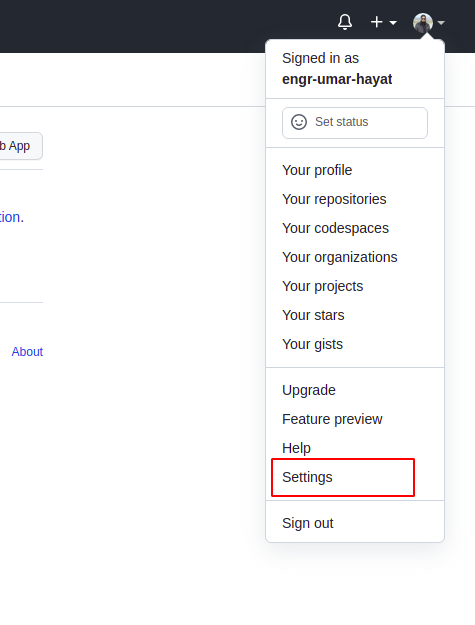
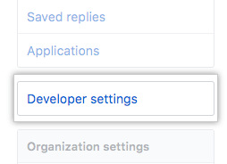
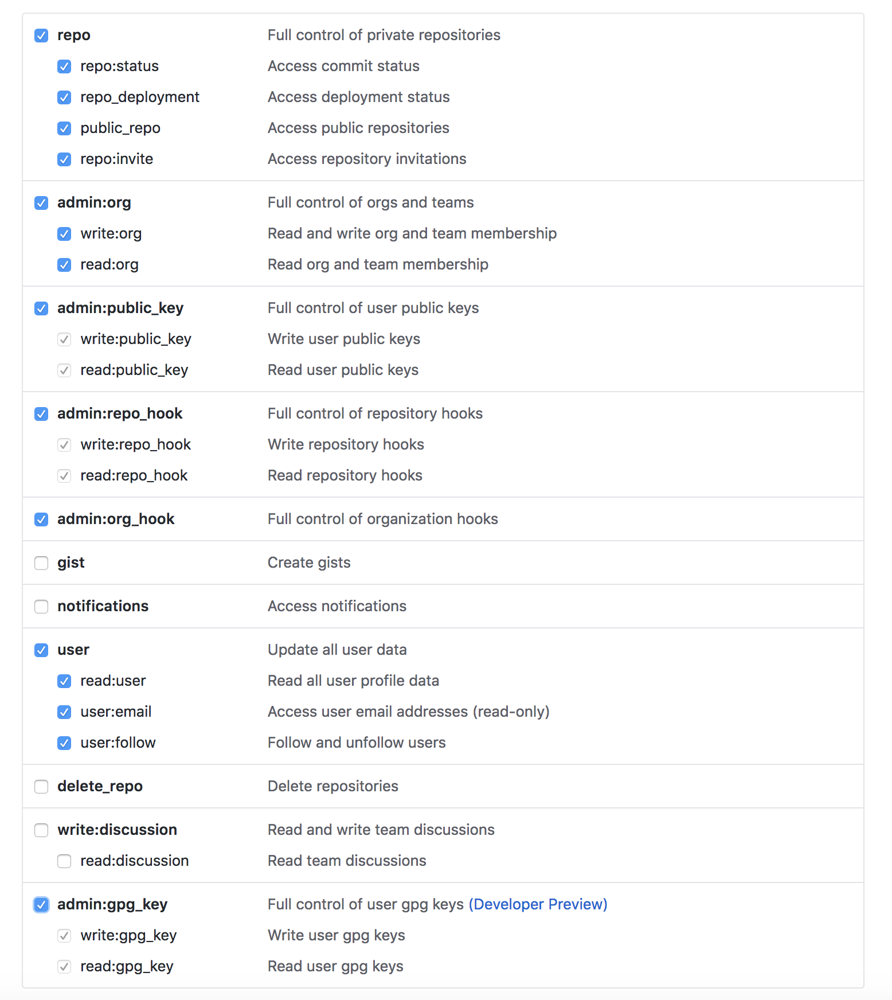
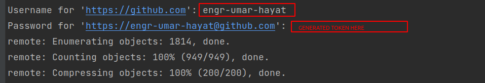

# Solução Simples para Problemas de Autenticação no Git no Linux

## Passos:

1. **Remover Credenciais Locais:**
   ```sh
   git config --local --unset credential.helper
   ```

2. **Remover Credenciais Globais (se aplicável):**
   ```sh
   git config --global --unset credential.helper
   ```

3. **Gerar um Token de Acesso Pessoal no GitHub:**

   - Vá para as configurações da sua conta no GitHub.
   
   - Clique em "Developer settings" (Configurações de desenvolvedor).
   
   - Selecione "Personal Access Tokens" (Tokens de acesso pessoal).
   
   - Gere um token com as permissões necessárias.
   

4. **Autenticação com Token:**

   - Dentro do repositório Git, execute:
     ```sh
     git pull
     ```
   - Forneça seu nome de usuário e o token gerado como senha.
   

   Este é um procedimento direto e passo a passo para resolver problemas de autenticação.

## Nota:

Se você se irritar com o Git pedindo o nome de usuário/token repetidamente, siga estes três passos simples:

1. **Editar Credenciais:**
   - Execute:
     ```sh
     nano ~/.git-credentials
     ```
   - Remova a linha referente ao GitHub e salve o arquivo.

2. **Configurar Armazenamento de Credenciais:**
   ```sh
   git config --global credential.helper store
   ```

   *Risco:* O token será armazenado fisicamente no arquivo `~/.git-credentials`.

3. **Autenticação Persistente:**
   - Execute:
     ```sh
     git pull
     ```
   - Forneça o nome de usuário e a senha/token apenas uma vez.

   Agora, o Git não solicitará o nome de usuário e o token repetidamente!

## Referências:
[Stack Overflow](https://stackoverflow.com/questions/68775869/message-support-for-password-authentication-was-removed)
